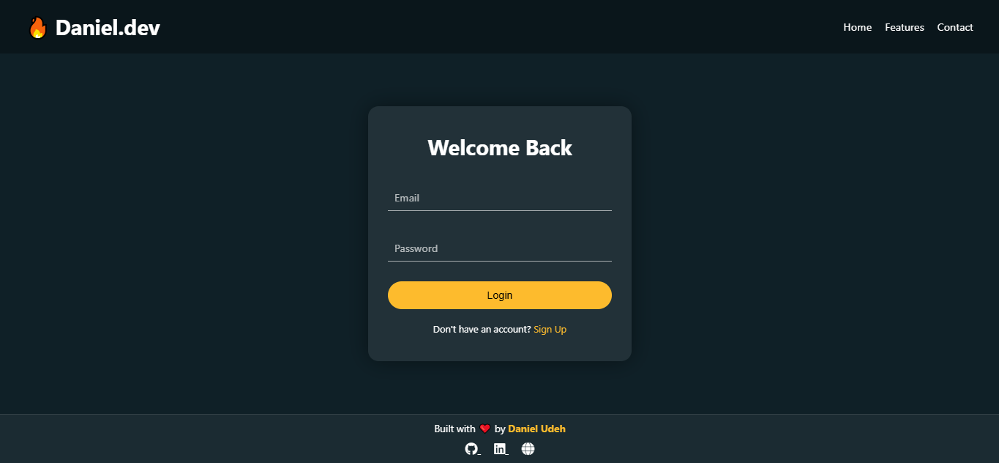

# 🔐 Responsive Login Page

A sleek and fully responsive login page built using **HTML**, **CSS** and **Vanilla Javascript**, designed with modern UI/UX principles and mobile-first responsiveness in mind.

## 🌟 Features

- ✅ Fully responsive layout for all screen sizes
- ✅ Clean and modern UI design
- ✅ Glassmorphism effect for login box
- ✅ Custom styled input fields and buttons
- ✅ Mobile-friendly hamburger menu 
- ✅ Animated background and hover effects

## 📸 Preview

> 📱 The design adjusts seamlessly on mobile, tablet, and desktop.

## 🚀 Live Demo

👉 [View Project](https://diddy0077.github.io/Responsive-Login-Page/)

## 🛠️ Built With

- HTML5
- CSS3 (Flexbox, gradients, animations)
- Vanill Javascript

## 📁 Project Structure
Responsive-Login-Page/
├── index.html
├── style.css
└── assets/
└── login-page.png (screenshot or design image)

This login page can be reused as a UI component in:

- SaaS web apps
- Portfolio dashboards
- User authentication interfaces
- Admin panels

## 📚 What I Learned

- Responsive layout design with Flexbox
- Creating modern glass-like UI (glassmorphism)
- Enhancing UI with CSS transitions and hover effects
- Mobile-first design principles

## 🧠 Author

**Daniel / Diddy0077**  
🌐 [Portfolio](https://diddy0077.github.io/daniel-udeh/) 
🐙 [GitHub](https://github.com/diddy0077)

## 📜 License

This project is licensed under the [MIT License](LICENSE).

---

> Feel free to fork, customize, and use this layout in your own projects!
